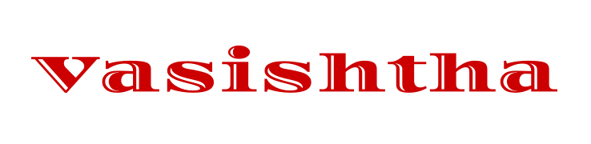

### 
### A MVC Framework for building Web Applications on Node.js

## Goal 
This project is aiming to provide a holistic Web Application Development framework inspired by [Struts](https://en.wikipedia.org/wiki/Apache_Struts_1) and [Spring MVC](https://en.wikipedia.org/wiki/Spring_Framework) with utmost **effectiveness** and **efficiency**, making it easy to use and provide the best possible **DX**(Developer Experience) with minimum **deployment** hassles.

### This project is currently Underdevelopment 👷!
